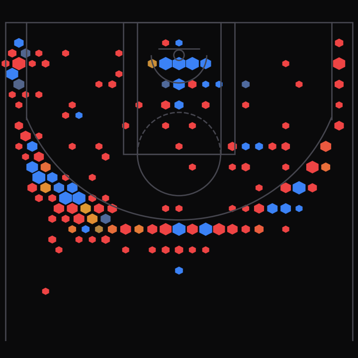

# shot-location

An interactive NBA shot chart built from the 2015-16 play-by-play logs — every
shot a player took that season, binned into hexagons by court location and
colored by how their field-goal percentage compared to the league average from
that distance.

Stephen Curry's unanimous-MVP season is the default view; thirteen other stars
are a dropdown away. Published as a post on my site (Data Stories): *I just love
shot charts*.



## How to read it

- **Hexagon size** — how often the player shot from that spot (bigger = more attempts).
- **Hexagon color** — the player's FG% there vs. the league average from that
  distance (blue = colder, red = hotter).

## Pipeline

| File | Role |
| --- | --- |
| `extract_shots.py` | Streams the combined play-by-play CSV → `shots.json` (per-player shots + a league FG%-by-distance baseline). |
| `make_thumbnail.py` | Renders `thumbnail.png` (matplotlib) from `shots.json`. |
| `shotchart.html` | Self-contained D3 + d3-hexbin chart that reads `shots.json`. Serve it over a local server. |
| `shots.json` | Generated data (~190 KB). |

```bash
# point at your local copy of the 2015-16 combined-stats CSV
export NBA_PBP_CSV="/path/to/[10-20-2015]-[06-20-2016]-combined-stats.csv"
python3 extract_shots.py      # -> shots.json
python3 make_thumbnail.py     # -> thumbnail.png
python3 -m http.server        # then open http://localhost:8000/shotchart.html
```

## Data

2015-16 NBA play-by-play logs from [eightthirtyfour.com](https://eightthirtyfour.com/data).
Shot coordinates use the NBA stats convention: the hoop is at `(0, 0)` and 10
units equal one foot.

The original exploratory notebooks (`main.ipynb`, `processing.ipynb`,
`shot-location-R.ipynb`) are kept for reference.
